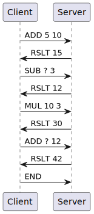
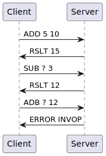

# Specification of the protocol

## 1. Overview
This protocol is a client-server protocol. The client connects to the server and asks the result of a mathematical operation. The server computes the result and sends it back to the client or sends an error message if the operation is not valid.

## 2. Transport layer protocol
This protocol uses TCP as transport layer protocol. It has to known the IP address of the server. The server listens on the port `4242`. 

The client closes the connection by sending the `END` message. The server closes the connection when it receives the `END` message or after a timeout of 10 seconds.

Data is sent as a UTF-8 string. The string is composed of the operation and the operands separated by a space. The server sends the result or the error message as a string.

The operands are integers.

Each line is terminated by a `;` character.

## 3. Messages
Here are the messages exchanged between the client and the server :

### Client sent :
- `ADD a b` : the server computes `a + b` and sends the result to the client
- `SUB a b` : the server computes `a - b` and sends the result to the client
- `MUL a b` : the server computes `a * b` and sends the result to the client
- `DIV a b` : the server computes `a / b` and sends the result to the client
- `MOD a b` : the server computes `a % b` and sends the result to the client
- `POW a b` : the server computes `a ^ b` and sends the result to the client
- `END` : the client ends the connection

The use of `?` as a number can be used to refer to the result of the last operation.

### Server sent :
- `RSLT a` : the server sends the result of the last operation to the client
- `ERROR code [txt]` : the server sends an error message to the client. The error code is a number and the error text is a string. The error text is optional and is used to give more information about the error.

## 4. Specific elements
Error can be one of the following :
- INVOP : invalid operation
- INVNB : invalid number of arguments
- DIV0 : division by zero
- INVARG : invalid argument
- UNKERR : unknown error
- BADREF : use of `?` as a number but no previous operation

## 5. Example dialogs
### Classic dialog :

### Error dialog :
